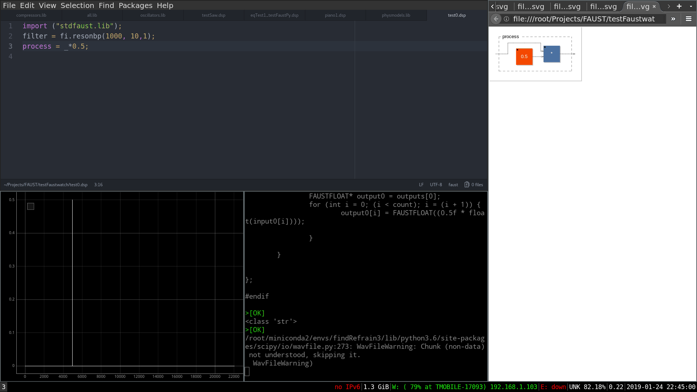

# Tools for analyzing Faust programs
At the moment there is one tool present, faustwatch.py

## Faustwatch

Faustwatch is a tool that observes a .dsp file used by the dsp language [FAUST](https://faust.grame.fr/). If the file is changed (saved after editing): 
- the blockdiagram can be automatically shown in the default browser
- the impulse response can be plotted in the time domain
- the impulse response can be plotted in the frequency domain.
- the time and frequency domain plots of the last saved version are always visible so the current and last saved version can be compared.
- the impulse response is played back via pyo and Jack Audio
- an audio file can be processed and the ouput can be plotted and played back

Basically it is supposed to make FAUST development faster.

Here you can see it in action:


### Install
#### Dependencies
This has only been tested under Linux and with python 3.6.3. It requires a number of standared libraries such as numpy,scipy: 
- numpy 1.15.4
- scipy 1.1.0

and it requires some more uncommon libraries:
- pyo 0.9.0
- pyqtgraph 0.10.0
- pyinotify 0.9.6
- pyzmq 17.1.2

This tool has not been tested with other versions of these libraries. Of course there is a good chance it will work just fine with newer versions of these.
#### Configuration
The file ```config.py``` has to be changed in order to make sure that:
- the architecture file for offline processing can be found.
- the right python executable is used to start the plotting process.


### usage
``` bash
usage: faustwatch [-h] [--svg] [--ir] [--af AF] [--impLen IMPLEN] [--line] N

Watch a dsp file for changes and take a specific action.

positional arguments:
  N                Path to a .dsp file

optional arguments:
  -h, --help       show this help message and exit
  --svg            Make an svg block diagram and open it.
  --ir             Get impulse response and plot it.
  --af AF          Send through audio file.
  --impLen IMPLEN  Length of impulse. Default is unit impulse, so 1.
  --line           Get response to line from -1 to 1. So input-output
                   amplitude relationship. Useful for plotting transfer
                   functions of non-linearities

```